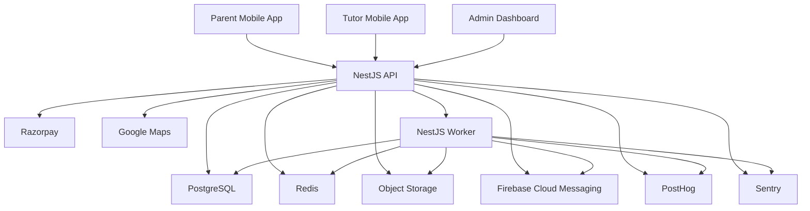
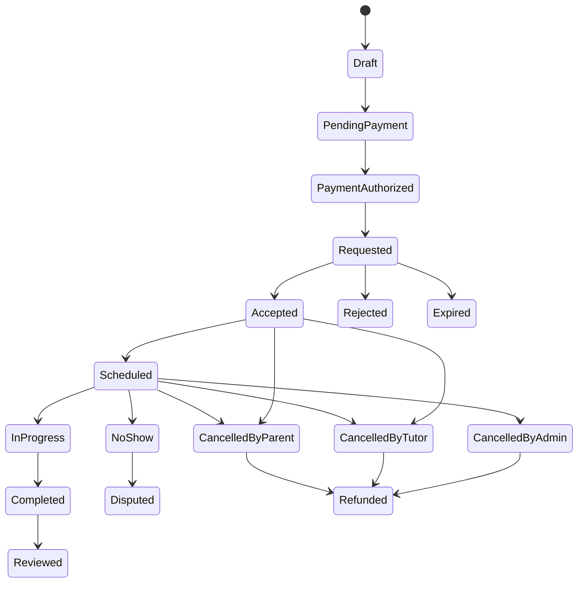
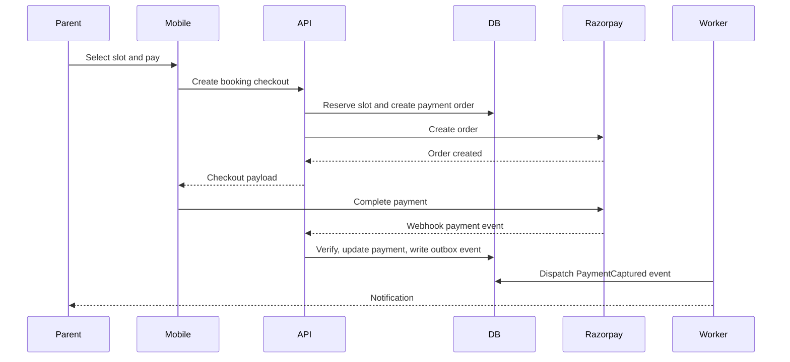

# System Architecture

## 1. Purpose

This document defines the technical architecture for the tutor marketplace described in the PRD. It is the second milestone and should guide the folder structure, database schema, API contracts, authentication system, backend services, mobile app, admin dashboard, and future AI modules.

The architecture optimizes for parent trust, child safety, fast booking, tutor reliability, repeat classes, operational visibility, and the North Star metric: Weekly Completed Classes.

## 2. Executive Architecture Decisions

| Decision | Choice | Rationale |
| --- | --- | --- |
| Application topology | Modular monolith for MVP | Booking, payments, verification, and child data need strong consistency and fast iteration. Module boundaries keep future service extraction possible. |
| Backend framework | NestJS with TypeScript | Strong dependency injection, module boundaries, testability, validation, guards, and background worker support. |
| Primary database | PostgreSQL with Prisma ORM | Relational integrity is critical for bookings, payments, identity, and auditability. Prisma gives maintainable schema and migrations. |
| Queue and cache | Redis with BullMQ | Reliable background jobs for notifications, webhooks, reminders, analytics, and settlement workflows. |
| API style | REST first | Simple mobile/admin integration, easy OpenAPI documentation, clear request/response contracts, and predictable versioning. |
| Event model | Domain events with transactional outbox | Prevents lost side effects when booking/payment state changes and supports later event-driven scaling. |
| Payments | Razorpay-first payment adapter | India-first conversion and operational fit, while retaining an interface for Stripe later. |
| Search | PostgreSQL indexes first, search service later | Faster MVP delivery. Search can evolve to OpenSearch or a dedicated ranking service after liquidity grows. |
| AI | Feature-flagged assistive modules | AI needs reliable product data and auditability before it can influence marketplace decisions. |
| Admin operations | First-class internal product | Trust, refunds, verification, and support cannot be handled as database scripts. |

## 3. System Context



## 4. Runtime Applications

### Mobile App

React Native with Expo and TypeScript.

Primary surfaces:

- Parent experience
- Tutor experience
- Student dashboard where age-appropriate

The mobile app should be role-aware after authentication. A single mobile app can support both parent and tutor accounts for MVP, with role-specific navigation and permissions.

### Admin Dashboard

React with TypeScript, deployed separately from the mobile app. A Next.js-based admin app is recommended because it fits Vercel deployment, route-based admin workflows, and future server-rendered operational pages if needed.

The admin dashboard is not a marketing site. It is an operational console for verification, bookings, payments, refunds, support, fraud review, analytics, and audit inspection.

### API Application

NestJS application exposing REST endpoints under `/v1`.

Responsibilities:

- Authenticate requests.
- Authorize access.
- Validate input.
- Execute application use cases.
- Coordinate domain operations.
- Persist data through repositories.
- Record audit logs.
- Create outbox events.
- Serve mobile and admin clients.

### Worker Application

NestJS worker process using BullMQ.

Responsibilities:

- Process outbox events.
- Send push notifications.
- Handle payment reconciliation.
- Generate invoices and reports.
- Send reminders.
- Run delayed booking and cancellation jobs.
- Dispatch analytics events.
- Run AI jobs after feature flags enable them.

The API and worker can share application packages and domain modules, but they should run as separate processes.

## 5. Bounded Contexts

The MVP should be implemented as a modular monolith with strict module boundaries. Each context owns its domain models, use cases, repository interfaces, policies, and events.

| Context | Owns | Key Use Cases | Key Events |
| --- | --- | --- | --- |
| Identity and Access | Users, roles, sessions, OTPs, auth providers | Login, refresh token, role assignment, account status | UserRegistered, UserLoggedIn, RoleChanged |
| Family | Parent profiles, students, guardians | Add child, update child profile, link parent to student | StudentCreated, ChildProfileUpdated |
| Tutor Supply | Tutor profiles, qualifications, subjects, service modes, pricing | Tutor onboarding, profile updates, pricing setup | TutorProfileCreated, TutorProfileUpdated |
| Verification | KYC documents, verification checks, reviewer decisions | Submit documents, approve tutor, reject tutor, request changes | VerificationSubmitted, TutorApproved, TutorRejected |
| Catalog | Subjects, grades, curricula, service categories | Manage subject taxonomy, map tutor offerings | SubjectCreated, TutorSubjectAdded |
| Search and Matching | Search indexes, ranking inputs, recommendations | Search tutors, rank tutors, explain recommendation | TutorSearchPerformed, TutorRecommended |
| Availability | Availability slots, blackout periods, location coverage | Set calendar, reserve slot, release slot | SlotReserved, SlotReleased, AvailabilityUpdated |
| Booking | Bookings, booking state machine, cancellation rules | Create booking, accept, reject, cancel, complete, dispute | BookingRequested, BookingAccepted, BookingCompleted |
| Payment | Payment orders, captures, refunds, invoices | Create order, process webhook, reconcile payment, refund | PaymentAuthorized, PaymentCaptured, RefundProcessed |
| Wallet and Ledger | Tutor balances, ledger entries, withdrawals | Credit tutor, hold funds, request withdrawal | LedgerEntryCreated, WithdrawalRequested |
| Learning Operations | Attendance, homework, assignments, progress notes | Mark attendance, assign homework, submit homework | AttendanceMarked, HomeworkAssigned |
| Reviews and Reputation | Ratings, reviews, quality signals | Submit review, moderate review, update reputation | ReviewSubmitted, ReputationUpdated |
| Messaging | Conversations, messages, attachments | Parent-tutor messaging, moderation, read receipts | MessageSent, MessageFlagged |
| Notifications | Push tokens, notification preferences, templates | Send booking updates, reminders, homework alerts | NotificationQueued, NotificationSent |
| Analytics | Product events, funnels, attribution | Track search, booking, completion, retention | AnalyticsEventRecorded |
| Admin Operations | Admin actions, support workflows, overrides | Verify tutor, refund booking, adjust booking, ban user | AdminActionRecorded |
| AI Foundation | AI prompts, model runs, recommendation artifacts | Generate study plan, summarize progress, assist matching | AiRunRequested, AiRunCompleted |

## 6. Clean Architecture Layers

Each backend module should follow the same internal shape.

### Domain Layer

Contains business objects and rules that should not depend on NestJS, Prisma, Redis, payment gateways, or HTTP.

Examples:

- Booking aggregate and booking state transitions
- Payment ledger rules
- Tutor verification status rules
- Cancellation policy
- Review eligibility rules
- Attendance completion rules

### Application Layer

Contains use cases and orchestration.

Examples:

- `CreateBooking`
- `AcceptBooking`
- `SubmitTutorVerification`
- `CapturePaymentWebhook`
- `MarkAttendance`
- `SubmitReview`

Application services depend on repository interfaces and external gateway interfaces, not concrete infrastructure.

### Interface Layer

Contains controllers, request DTOs, response DTOs, guards, interceptors, and presenters.

The interface layer translates HTTP into application use cases. It should not contain business rules.

### Infrastructure Layer

Contains Prisma repositories, Redis cache adapters, BullMQ producers, object storage adapters, Razorpay adapters, FCM adapters, analytics adapters, and Sentry integration.

Infrastructure is replaceable behind interfaces.

## 7. Backend Module Boundary Rules

- Modules cannot directly read or write another module's tables through ad hoc Prisma calls.
- Cross-module behavior should go through application services, domain events, or published read models.
- Shared utilities must stay small and generic.
- Business rules must not live in controllers.
- Payment and booking state changes must be transactional.
- Every admin override must write an audit log.
- Sensitive data access must go through explicit permission checks.

## 8. Data Architecture

### Primary Store

PostgreSQL is the system of record.

Use relational constraints for:

- User ownership
- Parent-student relationships
- Tutor-subject relationships
- Booking participants
- Payment and booking references
- Attendance tied to bookings
- Ledger entries tied to payment events

### Prisma ORM

Prisma should own schema migrations and typed data access.

Repository implementations should wrap Prisma calls so domain use cases do not depend directly on Prisma.

### Transaction Strategy

Use database transactions for:

- Booking creation and slot reservation
- Booking acceptance and payment state update
- Payment webhook handling
- Refund and ledger updates
- Attendance completion and booking completion
- Admin verification decisions

### Outbox Pattern

Domain events that require side effects must be written to an outbox table in the same database transaction as the state change.

Outbox examples:

- `BookingRequested`
- `BookingAccepted`
- `PaymentCaptured`
- `ClassReminderDue`
- `BookingCompleted`
- `ReviewSubmitted`
- `TutorApproved`

A worker dispatches outbox events to queues, notifications, analytics, search indexing, and AI jobs.

### Audit Logs

Audit logs are append-only records for security, support, and compliance.

Audit log required for:

- Admin login
- Role changes
- Tutor approval or rejection
- KYC document access
- Booking cancellation override
- Refund creation
- Wallet adjustment
- Account suspension
- Payment webhook processing result

### Soft Deletes

Do not physically delete business records by default. Use status fields and deletion metadata.

Privacy deletion workflows should anonymize or redact personal data while preserving financial and audit integrity where legally required.

## 9. API Architecture

REST endpoints should be versioned under `/v1`.

Recommended route groups:

- `/v1/auth`
- `/v1/me`
- `/v1/parents`
- `/v1/students`
- `/v1/tutors`
- `/v1/subjects`
- `/v1/search`
- `/v1/availability`
- `/v1/bookings`
- `/v1/payments`
- `/v1/wallet`
- `/v1/attendance`
- `/v1/homework`
- `/v1/reviews`
- `/v1/messages`
- `/v1/notifications`
- `/v1/admin`
- `/v1/webhooks`

### API Contract Rules

- Validate all input with DTO schemas.
- Return consistent error shapes.
- Use cursor pagination for feeds and search results.
- Use idempotency keys for payment, booking, refund, and webhook-sensitive operations.
- Include request correlation IDs in logs and responses.
- Never expose internal database IDs where public IDs are safer.
- Use OpenAPI generation from the NestJS codebase.

### Standard Error Shape

```json
{
  "error": {
    "code": "BOOKING_SLOT_UNAVAILABLE",
    "message": "The selected time slot is no longer available.",
    "requestId": "req_123",
    "details": {}
  }
}
```

## 10. Authentication Architecture

### Supported Login Methods

MVP:

- Mobile OTP
- Email and password or email OTP
- Google login

Post-MVP:

- Apple login
- Additional provider integrations

### Token Model

- Short-lived JWT access token.
- Rotating refresh token stored securely.
- Refresh token reuse detection.
- Device/session tracking.
- Server-side session revocation.

### Account Roles

Core roles:

- Parent
- Tutor
- Student
- Admin
- Support

Student access should be limited and parent-controlled. For younger children, the student dashboard can be accessed inside the parent-authenticated session.

### Admin Security

Admin accounts require stronger controls:

- Mandatory MFA after MVP or before production launch if feasible.
- IP and device anomaly monitoring.
- Fine-grained permissions.
- Full audit logs.
- Session revocation tools.

## 11. Authorization Architecture

Use RBAC for broad permissions and resource-level authorization for ownership.

Examples:

- A parent can read only their own student profiles.
- A tutor can read only bookings assigned to them.
- A tutor cannot become searchable until approved.
- A support user can view operational data but should see masked sensitive fields unless elevated.
- Only finance admins can issue refunds or wallet adjustments.
- Only verification admins can approve tutor KYC.

Authorization checks should be implemented as reusable guards and policy functions.

## 12. Booking Engine

The booking engine is the core marketplace workflow.

### Booking State Machine



### Booking Invariants

- A booking must belong to one student and one parent account.
- A booking must reference one tutor and one subject.
- A booking must have a service mode: online, home tuition, group, or camp.
- A booking cannot be accepted by an unverified tutor.
- A tutor cannot accept overlapping bookings.
- Payment-sensitive operations must be idempotent.
- Completed classes must have attendance state.
- Reviews can be submitted only for completed classes.
- Cancellation fees depend on policy and timing.

### Slot Reservation

When a parent starts checkout, the selected slot should be reserved for a short TTL. If payment authorization or booking request creation fails, the reservation expires and the slot is released.

This prevents double booking while keeping inventory from being locked forever.

## 13. Payment Architecture

### Payment Provider Abstraction

The domain should depend on a payment gateway interface, not Razorpay directly.

Initial implementation:

- Razorpay order creation
- Razorpay payment verification
- Razorpay webhook signature verification
- Razorpay refund support

Future implementation:

- Stripe adapter
- UPI-specific enhancements
- Subscription billing

### Payment Flow



### Payment Rules

- Never trust only the client payment callback.
- Verify webhooks with provider signatures.
- Store provider payment IDs and order IDs.
- Enforce idempotency for webhook processing.
- Keep a ledger for tutor earnings and platform commission.
- Release tutor earnings according to completion and settlement policy.
- Refunds must be tied to booking and payment records.

## 14. Search and Matching Architecture

### MVP Search Pipeline

1. Parse parent query and filters.
2. Apply hard filters: subject, grade, mode, city, verification status, availability, price range.
3. Retrieve candidates from PostgreSQL using indexed queries.
4. Apply distance filtering for home tuition.
5. Score candidates using deterministic ranking.
6. Return paginated results with trust and availability signals.
7. Record analytics event for search quality.

### Ranking Inputs

- Subject match
- Grade match
- Curriculum match
- Availability match
- Distance
- Verification completeness
- Completed class count
- Rating quality
- Cancellation rate
- Tutor response speed
- Repeat booking rate
- Price fit
- Trial availability

### Future Search Evolution

As liquidity grows, search can move to a dedicated service or index such as OpenSearch. The API should hide search infrastructure behind a `TutorSearchService` interface so the implementation can evolve without changing client contracts.

## 15. Tutor Verification Architecture

Tutor verification is a first-class workflow, not a profile field.

### Verification Stages

- Draft profile
- Documents submitted
- Under review
- Changes requested
- Approved
- Rejected
- Suspended

### Verification Data

Store verification metadata in PostgreSQL. Store document files in object storage using private access and short-lived signed URLs.

KYC document access must be audit logged.

### Activation Rule

A tutor can appear in parent search only when:

- Required identity checks are approved.
- Required qualification checks are approved or explicitly waived by policy.
- Profile quality requirements are met.
- At least one subject and one availability slot exist.
- Account status is active.

## 16. Learning Operations Architecture

Learning operations prove that the marketplace creates student outcomes, not just bookings.

MVP learning operations:

- Attendance
- Homework assignment
- Homework submission status
- Tutor class notes
- Parent-visible class summary
- Basic progress indicators

Post-MVP:

- Study plans
- Practice quizzes
- Weakness detection
- AI-generated progress summaries
- Achievement badges
- Learning streaks

Attendance and class completion should feed marketplace quality metrics and tutor payouts.

## 17. Messaging and Communication

### MVP Recommendation

Use structured notifications and booking notes first. Real-time chat can follow once trust and moderation rules are ready.

### Post-MVP Chat

When real-time chat is introduced:

- Persist all messages.
- Use WebSockets or a managed realtime channel.
- Allow only booking-linked conversations.
- Support attachment controls.
- Add moderation and abuse reporting.
- Mask direct phone/email sharing where required by policy.
- Give admins audit access for dispute review.

## 18. Notification Architecture

Notifications should be event-driven through the outbox and queue system.

Notification channels:

- Push notification through Firebase Cloud Messaging
- Email after MVP or as needed
- SMS/WhatsApp after MVP for high-value transactional reminders

Notification examples:

- OTP login
- Booking requested
- Booking accepted
- Booking rejected
- Payment captured
- Class reminder
- Homework assigned
- Refund processed
- Tutor verification approved
- Tutor verification changes requested

Users should have notification preferences, but critical safety and payment notifications should remain mandatory.

## 19. AI Architecture

AI modules should be isolated behind explicit services and feature flags.

### AI Safety Rules

- AI cannot approve tutors.
- AI cannot make refund decisions.
- AI cannot make child safety decisions.
- AI outputs shown to parents must separate verified facts from generated recommendations.
- AI runs must store inputs, model metadata, output summaries, and audit references.
- AI should be disabled per feature flag if quality drops.

### AI Data Foundation

Collect structured data first:

- Search queries
- Booking outcomes
- Tutor profile attributes
- Availability response times
- Attendance
- Homework
- Reviews
- Progress notes
- Cancellation reasons

Initial AI use cases:

- Tutor matching explanations
- Parent search intent parsing
- Study plan drafts
- Progress summary drafts
- Practice question generation

## 20. Background Jobs

Recommended queues:

- `outbox-dispatch`
- `notifications`
- `payments`
- `booking-expiry`
- `class-reminders`
- `analytics`
- `search-indexing`
- `reports`
- `ai`

Job rules:

- Jobs must be idempotent.
- Jobs must log correlation IDs.
- External API failures must retry with backoff.
- Poison jobs should move to a dead-letter workflow.
- Payment and booking jobs must never silently fail.

## 21. Observability

### Logging

Use structured JSON logs with:

- Request ID
- User ID where safe
- Role
- Endpoint
- Booking ID where relevant
- Payment ID where relevant
- Latency
- Error code

PII and KYC data must be redacted from logs.

### Monitoring

Use Sentry for application errors and performance traces.

Track:

- API latency
- Error rates
- Payment webhook failures
- Booking conversion
- Queue depth
- Job failure rate
- Notification failure rate
- Login failure rate
- Search latency

### Product Analytics

Use PostHog for product events and funnels.

Core events:

- `parent_registered`
- `student_created`
- `tutor_search_performed`
- `tutor_profile_viewed`
- `booking_checkout_started`
- `payment_completed`
- `booking_requested`
- `booking_accepted`
- `class_completed`
- `review_submitted`
- `trial_converted`

## 22. Security Architecture

Security controls:

- Strict DTO validation.
- Rate limiting for OTP, login, search, booking, and messaging.
- JWT access tokens with rotating refresh tokens.
- Password hashing with a modern adaptive algorithm if passwords are used.
- Webhook signature verification.
- Object storage with private buckets and signed URLs.
- Role and resource authorization guards.
- Admin audit logs.
- Secrets stored outside source control.
- PII redaction in logs.
- Secure CORS configuration.
- CSRF protection for browser-based admin sessions where applicable.
- Database backups and restore drills.
- Principle of least privilege for production credentials.

Child safety controls:

- Tutor activation blocked until verification is approved.
- Parent-controlled student accounts.
- Booking-linked communication.
- Abuse reporting.
- Admin review tools.
- OTP check-in and check-out for home tuition after MVP or earlier if home tuition launches first.

## 23. Performance Architecture

Performance targets:

- Common read API p95 below 200 ms.
- Search response optimized for perceived speed.
- Mobile app startup below 2 seconds on target devices.
- Booking and payment operations reliable before being merely fast.

Caching candidates:

- Subject taxonomy
- Public tutor profile summaries
- Search filter metadata
- Availability read models with short TTL
- Feature flag values

Avoid caching:

- Payment state without strong invalidation
- KYC data
- Admin permission checks
- Sensitive child data unless explicitly safe and encrypted

Database indexing priorities:

- Tutor status and verification status
- Tutor subjects and grades
- Tutor service modes
- Tutor city and location
- Availability windows
- Booking participant IDs
- Booking state
- Payment provider IDs
- Audit log actor and entity references

## 24. Deployment Architecture

### Environments

- Local
- Development
- Staging
- Production

### Local Development

Docker Compose should provide:

- PostgreSQL
- Redis
- API
- Worker
- Optional local object storage emulator

The mobile app can run with Expo against the local API.

### Production Deployment

Recommended MVP deployment:

- API on Railway or equivalent container host.
- Worker on Railway or equivalent worker process.
- PostgreSQL as a managed database.
- Redis as a managed service.
- Admin dashboard on Vercel.
- Object storage on AWS S3 or Supabase Storage.
- Mobile app distributed through Expo/EAS builds.

### CI/CD

GitHub Actions should run:

- Install
- Typecheck
- Lint
- Unit tests
- Integration tests
- Prisma migration validation
- Docker build
- Deployment to staging
- Manual approval for production deployment

## 25. Failure Handling and Consistency

### Payment Webhook Failure

If webhook processing fails:

- Store raw event metadata.
- Retry idempotently.
- Alert operations after repeated failures.
- Reconcile against provider API.

### Booking Acceptance Race

If two parents attempt the same tutor slot:

- Use slot reservation and database constraints.
- Only one booking can reserve or confirm the slot.
- Losers receive a clear unavailable-slot response and alternate suggestions.

### Notification Failure

If push notification fails:

- Retry if transient.
- Mark token invalid if provider says it is invalid.
- Keep booking state independent from notification success.

### Worker Downtime

If workers are unavailable:

- API continues to write outbox events.
- Workers resume from persisted queues and outbox records.
- Operations dashboard should show delayed jobs.

## 26. Feature Flags

Feature flags should control:

- AI recommendations
- AI progress summaries
- Instant booking
- Recurring classes
- Wallet withdrawals
- Chat
- Referral programs
- Coupons
- Home tuition OTP check-in/check-out
- New city launch
- New subject launch

Flags should support role, city, subject, and percentage rollout where possible.

## 27. Testing Strategy

Architecture-level test expectations:

- Unit tests for domain policies and state machines.
- Application tests for use cases.
- Repository integration tests against PostgreSQL.
- Payment webhook integration tests.
- Booking race condition tests.
- Authorization tests for parent, tutor, and admin access.
- Worker job idempotency tests.
- API contract tests.
- Mobile smoke tests for core booking flow.
- Admin smoke tests for verification and refund flows.

Critical paths must be tested before production:

- Parent signup
- Student creation
- Tutor approval
- Search
- Booking checkout
- Payment webhook
- Tutor acceptance
- Attendance
- Class completion
- Review
- Refund

## 28. Service Extraction Path

The modular monolith should be designed so high-pressure contexts can be extracted later.

Likely extraction order:

1. Search and matching
2. Notifications
3. Payments and ledger
4. Messaging
5. AI processing
6. Analytics pipeline

Do not extract services before module boundaries, operational maturity, and load justify the cost.

## 29. Architecture Decision Log

| Date | Decision | Rationale |
| --- | --- | --- |
| 2026-07-02 | Use a modular monolith for MVP | Strong consistency and faster iteration matter more than premature service distribution. |
| 2026-07-02 | Use transactional outbox for side effects | Booking and payment events must not be lost if notification or analytics systems fail. |
| 2026-07-02 | Treat admin operations as a first-class application | Verification, refunds, disputes, and trust workflows are core to the marketplace, not back-office afterthoughts. |
| 2026-07-02 | Start search with PostgreSQL-backed ranking | MVP needs speed of learning. Dedicated search infrastructure can be introduced after marketplace demand is proven. |
| 2026-07-02 | Keep AI behind feature flags and audit logs | Parent trust and child safety require explainability, rollback, and human oversight. |

## 30. Milestone Handoff

Milestone 3 created the folder structure for a TypeScript monorepo with:

- NestJS API app
- NestJS worker app
- Expo mobile app
- Admin web app
- Shared packages
- Prisma package
- Infrastructure configuration
- Documentation

Milestone 4 added the normalized Prisma schema for the marketplace core.

Milestone 5 defined the REST API specification, including route groups, request and response contracts, authentication behavior, error shape, pagination, idempotency, and webhook contracts.

Milestone 6 should implement authentication foundations: JWT access tokens, rotating refresh tokens, OTP challenge flow, current-user endpoints, role guards, and session revocation.
